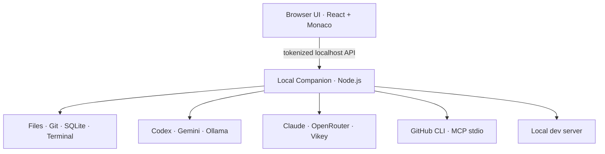

# Forge Web

Versi **0.9.0** menambahkan tab **Kanban**: task Build per proyek dengan kolom Backlog → To Do → In Progress → Review/Test → Done, mode biaya Economy/Balanced/Maximum, pencatatan token/biaya, dan gate regression checks sebelum Done. Lihat bagian [Kanban](#kanban).

Versi **0.8.0** menambahkan Phase 1 workspace agent: Universal Agent Core untuk Codex, OpenRouter, Vikey, Gemini, Ollama, dan Bonsai; reusable skills; Project Memory yang terpisah per proyek; Agent Activity Center; serta checkpoint review dengan diff, Accept, dan Undo. Activity Center hanya menampilkan aksi nyata berlevel tinggi—bukan private chain-of-thought—beserta durasi, status test/build, Retry/Stop, dan usage/cost ketika provider menyediakannya.

Semua kemampuan 0.7.6 tetap dipertahankan: chat bergaya ChatGPT, pilihan dark/light mode, Vikey AI, **Dedicated Chat**, **Multi-Agent Codex-style**, notifikasi approval, preview tab baru, annotation visual, layout responsif, penghapusan folder ke Trash, Security Gate, attachment multimodal, workspace/project management, dan local AI.

Forge adalah AI app builder personal yang berjalan di browser, dengan **local companion** Node.js di komputer Anda. UI ada di browser, sedangkan akses file, terminal, Git, preview, SQLite, credential, dan coding agent tetap berjalan lokal.

## Yang sudah tersedia

- Project picker: buat proyek starter atau buka folder lokal dengan path absolut.
- Chat bergaya ChatGPT dengan percakapan tersimpan, composer multiline yang selalu terlihat, mode **Ask / Plan / Build**, Stop/Send, dan streaming activity yang aman ditampilkan.
- Lampiran menjadi bagian dari composer chat yang sama: paperclip, multi-select, drag & drop, chips/removal, serta tampilan attachment di bubble pesan. Mendukung source code, config, teks, CSV, PDF, ZIP, gambar, video, audio, dan link. Isi file menjadi context Ask/Plan/Build. Pada Build, gambar asli disalin ke `public/forge-assets/` untuk proyek Vite/React/Next atau `assets/forge-uploads/` untuk web statis, lengkap dengan URL siap preview; lampiran nonpublik tetap disiapkan di `.forge/attachments/`.
- Forge Guide dapat dipilih terpisah antara Ollama lokal dan model OpenRouter yang sudah ditambahkan di Settings. Riwayat Guide tetap per proyek ketika provider diganti.
- Coding agent: Codex, Gemini CLI, dan Ollama lokal.
- Universal Agent Core memberi semua provider kontrak request/lifecycle yang konsisten tanpa menghilangkan capability khusus provider.
- Reusable skills bawaan `/debug`, `/test`, `/refactor`, `/security-check`, dan `/deploy`, plus custom skill per proyek dari tab **Agent**.
- Project Memory per proyek memetakan struktur, script penting, framework, convention, dan keputusan yang dapat diedit; memory proyek tidak bercampur.
- Agent Center menyimpan aktivitas high-level, elapsed time, status test/build, usage/cost bila tersedia, serta Stop dan Retry.
- Setiap Build membuat checkpoint sebelum perubahan. Hasil akhirnya menampilkan file/diff untuk Accept atau Undo/Restore yang aman.
- Bonsai 2 27B melalui `llama.cpp` lokal di Mac; Ask / Plan / Build dan Forge Guide memakai model dari server `/v1/models`.
- API provider tambahan: Anthropic Claude untuk Ask/Plan serta OpenRouter untuk Ask/Plan/Build pada model yang mendukung tool calling.
- OpenRouter Build meneruskan link yang sudah dibaca, hasil Web Search, gambar, dan audio asli kepada model yang mengiklankan modality terkait; dukungan berlaku untuk model Pro maupun Flash.
- Monaco Editor lokal, file explorer, save conflict protection, dan checkpoint otomatis.
- Terminal proyek dengan persetujuan eksplisit dan output di Activity.
- Live preview dalam iframe, desktop/mobile width, start/stop/refresh.
- Uji browser untuk Preview lokal: buka halaman, klik tombol, isi input, periksa teks, dan tampilkan error JavaScript/HTTP. Bisa dijalankan otomatis setelah Build selesai.
- Approval sensitif, Git checkpoint/restore, dan history/config di SQLite.
- GitHub import serta commit/push backup melalui `gh` CLI tanpa force-push.
- Sync / Pull mengambil commit baru pada branch aktif dengan fast-forward saja; perubahan lokal atau riwayat berbeda ditolak.
- Indikator penggunaan: persentase kuota Codex dalam jendela waktu serta token konteks Gemini jika CLI mengirimnya.
- MCP stdio registry, scope global/proyek, connection test, dan capability discovery.
- Deploy Center untuk alur Vercel/Cloudflare Pages dan EAS yang selalu meminta konfirmasi, dengan Security Audit sebelum deploy.
- Riwayat rilis per proyek di Deploy Center dan rollback deployment produksi web yang dikonfirmasi; catatan build mobile tersimpan terpisah.
- Monitoring HTTPS situs pascadeploy, dengan pemeriksaan berkala saat Forge berjalan dan riwayat 30 hasil per proyek.
- Panduan backend/database membaca stack proyek dan menyiapkan rencana Build untuk Supabase, Firebase, atau penyimpanan lokal.
- Pencarian web bersama untuk Ask, Plan, Build, dan Forge Guide, dengan tautan sumber di riwayat chat.
- Backup otomatis saat Forge dibuka dan pemulihan satu klik di Settings → Backup & pemulihan.

## Design Kit dan identitas desain proyek

Di tab **Agent**, gunakan **Reusable skills** untuk menambahkan command ke composer, lengkapi permintaan lalu kirim. Hanya command slash **pertama** yang dipilih; panduan lain tidak ikut dimuat. Skill lama dan custom tetap tersedia. Custom lama yang memakai nama command desain tetap diprioritaskan dan bisa diedit/dihapus; setelah dihapus, skill bawaan kembali muncul.

| Command | Kapan digunakan | Contoh |
| --- | --- | --- |
| `/design` | Arah visual atau alur halaman baru | `/design rancang checkout sesuai audiens proyek` |
| `/design-system` | Token dan komponen lintas halaman | `/design-system satukan warna action dan state tombol` |
| `/polish` | Finishing kecil tanpa redesign | `/polish rapikan jarak dan feedback form profil` |
| `/design-review` | Review berbasis bukti, bukan izin mengedit | `/design-review audit hierarki dan keyboard halaman utama` |
| `/responsive` | Reflow, overflow, dan konten panjang | `/responsive perbaiki tabel di layar sempit` |

Setiap panduan memuat pemilihan, workflow, contoh praktis, anti-pattern, checklist, dan aturan verifikasi jujur. Tidak ada gaya visual tunggal yang dipaksakan. **Ini bukan visual QA otomatis:** tanpa browser/screenshot agent wajib menyatakan batas verifikasi. Phase two tidak termasuk fitur ini.

### Mengisi identitas tanpa mengedit kode

Buka **Agent → Identitas desain → Atur identitas & token desain**. Isi arah visual, audiens, produk, keputusan, dan batasan. Di **Token desain**, tambah baris nama/nilai untuk warna, tipografi, spacing, radius, atau shadow. Kelompok boleh kosong; Forge tidak menciptakan palette atau font tanpa pilihan pengguna. Klik **Simpan identitas** dan tunggu konfirmasi hasil baca ulang. Simpan sebelum pindah proyek: draft belum tersimpan tidak ikut pindah. Respons terlambat dari proyek lama tidak mengubah form proyek baru. Kegagalan save mempertahankan draft; **Muat ulang** meminta konfirmasi sebelum membuangnya.

Identitas yang tersimpan otomatis ikut request **Ask / Plan / Build** berikutnya di jalur coding agent Codex, Gemini, Ollama, dan API provider yang ada, termasuk Build multi-agent yang didukung provider. Identitas diperlakukan sebagai konteks proyek, bukan instruksi sistem. Forge Guide memiliki jalur percakapan terpisah dan tidak diubah oleh fitur ini.

**Referensi:** maksimal 20 URL `http/https` tanpa kredensial atau `attachment:<id>` lampiran yang sudah ada di proyek ini (ID tersedia pada metadata lampiran pesan). Penyimpanan referensi tidak mengambil URL, mengunggah file, men-stage aset, atau mengirim gambar ke model. Lampiran yang ingin dianalisis tetap harus dipilih secara eksplisit di composer. Referensi attachment tidak membawa berkasnya ketika DESIGN.md dipindahkan ke proyek lain.

### File portabel, konflik, dan pemulihan

- **`DESIGN.md`** di root proyek adalah sumber kebenaran: dokumen format Forge dengan blok JSON identitas yang dapat dibaca manusia. **`design.tokens.json`** adalah export turunan dari `identity.tokens`, bukan sumber kedua. Tidak ada salinan tersembunyi di setting global atau database.
- Setiap save membuat checkpoint terlebih dahulu, memvalidasi revision kedua file, men-stage file sementara, lalu mengganti export dan dokumen canonical. Respons sukses diberikan sesudah hasil dibaca ulang. Rename per file bersifat atomik, tetapi dua file bukan transaksi filesystem tunggal: crash di antaranya terdeteksi sebagai konflik export dan dapat dipulihkan dari checkpoint.
- DESIGN.md milik pengguna **tidak ditimpa otomatis**. Form menampilkan dokumen dan checkbox **Impor dokumen lama**. Dengan konfirmasi, isinya dipertahankan verbatim dalam `importedNotes` dan checkpoint; save berikutnya tidak menghapus catatan impor. Dokumen lama di atas batas impor 16.000 karakter harus ditangani manual, tidak dipotong diam-diam.
- File token yang belum dimiliki Forge atau berbeda dari token canonical **memblokir save**. Pindahkan/rename file tersebut sendiri, atau pulihkan nilainya sesuai DESIGN.md, kemudian muat ulang. Tidak ada tombol overwrite paksa. Perubahan JSON canonical secara manual juga dapat memerlukan regenerasi export dengan cara ini. Isi tambahan di luar struktur dokumen Forge ditolak, bukan dibuang diam-diam.
- File hanya boleh berupa file biasa di project root canonical; symlink, hardlink, root berubah, file biner UTF-8 tidak valid, dan file lebih dari 64 KB ditolak. Revision melindungi perubahan eksternal yang terdeteksi; jangan menjalankan editor filesystem lain bersamaan saat save. Checkpoint mengikuti aturan ignore workspace yang sudah ada, jadi jangan ignore kedua file ini jika ingin dipulihkan melalui checkpoint.
- Input identity maksimal 48 KB, tiap field teks maksimal 2.000 karakter, catatan impor 16.000, URL 1.000, dan 40 token per kelompok. Warna menerima hex RGB/RGBA; font berupa nama/fallback string; spacing/radius angka nonnegatif sampai 10.000 dengan unit px/rem/em; shadow berupa teks CSS maksimal 200 karakter. Nama token dimulai huruf, lalu huruf/angka/tanda hubung, maksimal 40 karakter.
- Token memakai `$type`/`$value`: `color`, `fontFamily`, `dimension` (objek `{value, unit}`), serta `string` untuk shadow. **Ini format subset Forge, bukan klaim kepatuhan penuh DTCG.** Token disimpan sebagai data; Forge tidak mengeksekusi atau langsung memasukkan nilainya sebagai CSS.

### API lokal

Semua route memakai autentikasi Bearer dan pemeriksaan Host/Origin companion yang sudah ada:

- `GET /api/design-identity?projectId=<id>` → `{identity, revision, exists, needsImport, existingDocument, exportConflict}`.
- `POST /api/design-identity/save` → `{projectId, identity, expected: revision, importExisting?: true}`; mengembalikan snapshot terbaru setelah save. `expected` wajib berasal dari GET terakhir. Identitas malformed, konflik, proyek tak dikenal, atau agent sedang aktif mengembalikan error 400; tanpa autentikasi 401.
- `GET /api/agent-center?projectId=<id>` tetap mengembalikan katalog skills tanpa isi prompt. Tidak ada route `/api/agent-context`; assembly konteks dilakukan internal sebelum provider routing.

Contoh identity (field yang belum diperlukan boleh berupa string/kelompok kosong):

```json
{
  "direction": "Editorial hangat, pertahankan identitas lama",
  "audience": "Pembaca artikel panjang",
  "product": "Majalah daring",
  "constraints": "Jangan mengganti logo atau mengunduh font",
  "decisions": "Navigasi berbasis teks",
  "references": [],
  "tokens": {
    "colors": { "accent": { "$type": "color", "$value": "#235A48" } },
    "typography": { "body": { "$type": "fontFamily", "$value": "Georgia, serif" } },
    "spacing": { "section": { "$type": "dimension", "$value": { "value": 24, "unit": "px" } } },
    "radius": {},
    "shadows": {}
  }
}
```

Jalankan test fitur dengan `node --experimental-strip-types --test tests/design-*.test.mjs`, lalu `npm run check`. Seluruh fixture memakai temporary directory; untuk pengembangan terisolasi tetapkan `TMPDIR` di bawah scratch dan jangan memakai data/proyek live.

## Backup dan pemulihan

Buka **Settings → Backup & pemulihan Forge** untuk **Buat backup sekarang** atau **Pulihkan** dari tanggal tertentu. Forge juga mencoba membuat backup otomatis saat dibuka, maksimal sekali sehari ketika ada proyek. Snapshot berada di luar folder instalasi: `~/Library/Application Support/Forge Web/backups/` pada macOS atau `~/.local/share/forge-web/backups/` pada Linux. Lokasinya dapat diubah dengan `FORGE_BACKUP_DIR`, asalkan bukan di dalam folder data atau proyek Forge. Jangan hapus folder backup saat mengganti source Forge.

Snapshot menyimpan database proyek/chat/pengaturan, proyek yang dibuat Forge dan proyek eksternal yang terdaftar, lampiran, serta riwayat checkpoint. Forge memeriksa isi dan checksum sebelum memulihkan. Saat restore, Forge lebih dahulu membuat snapshot kondisi sekarang; proyek yang dipulihkan ditempatkan di folder baru di bawah `.forge/projects/`, sedangkan folder proyek lama yang berada di luar instalasi tidak ditimpa. Pemulihan dapat dilakukan juga dari instalasi source baru di komputer yang sama, selama folder backup tetap ada.

Snapshot lokal bisa mengandung kode dan file konfigurasi rahasia. Jaga akses ke folder backup. API key yang disimpan di macOS Keychain/Linux Secret Service serta `.env` milik instalasi Forge tidak disalin ke snapshot. `node_modules`, `dist`, cache build, dan tautan simbolik di dalam proyek tidak disalin; instal ulang dependensi bila diperlukan. Batas satu snapshot adalah 25.000 file atau 2 GB; Forge menolak backup yang terlalu besar tanpa menyimpan snapshot parsial. Jika backup otomatis gagal, lihat keluaran Terminal Forge.

## Pencarian web

Buka **Settings → Web Search**, buat [Brave Search API key](https://api-dashboard.search.brave.com/app/documentation/web-search/get-started), tempel dan klik **Simpan key**. Pada macOS key disimpan di Keychain; pada Linux gunakan Secret Service/libsecret. Klik **Uji pencarian** untuk memastikan koneksi. Tersedia juga `FORGE_BRAVE_SEARCH_API_KEY` untuk konfigurasi melalui environment; jangan memasukkannya ke repository.

Di chat pilih **Web · Otomatis** untuk mencari saat pertanyaan mengandung kebutuhan informasi terbaru atau URL publik; **Web · Cari** untuk selalu mencari; dan **Web · Offline** untuk tidak mengirim pertanyaan ke Brave. Pilihan berlaku pula di Forge Guide. Hasil pencarian dan tanggal pemeriksaan tersimpan di riwayat chat; klik sumber untuk memeriksa klaim. Pencarian tidak otomatis menambah kemampuan tool milik model: Forge mengirimkan hasil web sebagai konteks bersama ke model yang dipilih.

Pertanyaan pencarian dikirim ke Brave Search. Forge mencoba membaca dua halaman publik pertama melalui HTTPS dan membatasi ukuran/jenis konten; situs yang menolak akses tetap dapat muncul sebagai ringkasan hasil pencarian. Jangan sertakan kata sandi, API key, atau data pribadi dalam pertanyaan web. Jika pencarian gagal, Forge menampilkan keterbatasannya dan tidak mengklaim data telah diperbarui. Brave Search API mungkin memiliki biaya atau batas kuota sesuai akun Anda.

## Security Audit dan Fix

Di **Deploy Center → Security Audit**, Forge memindai source dan dependensi, lalu menampilkan temuan beserta tindakan yang disarankan. Klik **Perbaiki dengan Agent** untuk menyiapkan instruksi di chat Build; tinjau dan kirim instruksinya, lalu kembali untuk **Pindai ulang**. Kredensial yang terlanjur terpapar harus dirotasi di layanan terkait. Forge tidak menampilkan nilai kredensial dalam laporan dan tidak menjalankan deploy selama perbaikan.

Backend mengulang audit sebelum perintah deploy atau submit, termasuk saat dipanggil melalui API. Untuk web, hasil build atau staging diperiksa lagi sebelum upload. Temuan high/critical, kegagalan audit, atau file sensitif dalam paket upload memblokir deploy. File `.env` lokal yang tidak ikut upload Cloudflare dicatat sebagai peringatan; Vercel dan EAS memblokirnya karena source dikirim ke provider.

Proyek npm dengan dependensi memerlukan `package-lock.json` dan akses npm registry untuk menjalankan `npm audit --omit=dev`. Jika audit tidak dapat diselesaikan, deploy ditahan sampai pemeriksaan berhasil. Audit berbasis pola dan advisory npm tidak menggantikan review akses backend, database, dan konfigurasi layanan.

## Riwayat rilis dan rollback web

Buka **Deploy Center → Riwayat rilis**. Forge mencatat deploy berhasil/gagal dalam SQLite, terpisah per proyek dan layanan. Untuk melihat rilis lama termasuk yang dibuat di luar Forge dan mengaktifkan tombol **Rollback**, jalankan Forge dengan `CLOUDFLARE_API_TOKEN` dan `CLOUDFLARE_ACCOUNT_ID` (izin Pages Read/Write) atau `VERCEL_TOKEN`. Bila proyek Vercel berada di tim, tambahkan `VERCEL_ORG_ID`. Tanpa token, riwayat lokal tetap terlihat, tetapi Forge tidak dapat memverifikasi deployment online untuk rollback. Simpan pilihan hosting dan nama situs yang benar terlebih dahulu.

Rollback memerlukan konfirmasi tersendiri dan hanya tersedia bagi deployment **produksi** yang sukses. Cloudflare memakai API Pages; Vercel memakai CLI rollback. [Vercel Hobby](https://vercel.com/docs/cli/rollback) membatasi rollback ke deployment produksi sebelumnya. Preview tidak dapat di-rollback ke produksi melalui tombol ini. Rollback mengganti rilis online, tetapi tidak mengubah source di komputer atau isi database aplikasi. iOS dan Android menampilkan catatan build/submit Forge; rilis App Store/Play Store tidak mendukung rollback instan melalui fitur ini.

## Monitoring situs pascadeploy

Di **Deploy Center → Monitoring situs setelah deploy**, isi URL HTTPS situs yang digunakan pengguna, misalnya domain produksi. Anda dapat mengisi teks halaman yang wajib muncul, memilih interval 5–60 menit, lalu mengaktifkan pemeriksaan berkala. Klik **Periksa sekarang** untuk uji manual. Forge mencatat status HTTP, waktu respons, dan 30 hasil terakhir per proyek di database lokal. Saat monitoring aktif, Forge memeriksa lagi sesudah deploy web berhasil dan setiap interval **selama Forge berjalan**. Forge hanya menerima alamat publik dan tidak mengikuti pengalihan; jika situs memakai redirect, masukkan URL tujuan akhirnya. Monitoring tidak mengirim peringatan eksternal dan tidak melakukan rollback otomatis. Pemeriksaan HTTP tidak memastikan seluruh fungsi aplikasi dan backend sehat; untuk itu gunakan endpoint kesehatan aplikasi dan uji fungsional tersendiri.

## Menghapus proyek di macOS

Pilih proyek lalu klik **Hapus proyek** di bagian atas. Opsi default **Folder dan semua file** memindahkan folder proyek yang dipilih ke Trash macOS lalu membersihkan data lokal terkait, sehingga nama proyek langsung dapat digunakan kembali. **Hapus dari Forge saja** tetap tersedia bila Anda ingin menghapus daftar proyek, chat, memory agent, checkpoint, dan konfigurasi lokal terkait tetapi mempertahankan folder source. Ketik nama proyek dengan tepat sebagai konfirmasi. Agent, terminal, preview, dan deploy proyek harus dihentikan lebih dahulu; preview akan dihentikan otomatis. Folder root, home, data Forge, folder induk proyek Forge, dan template tidak dapat menjadi target. Backup Forge yang sudah ada tidak ikut dihapus. Folder pada volume eksternal mungkin perlu dihapus melalui Finder apabila macOS tidak dapat memindahkannya ke Trash pengguna.

Untuk menghapus seluruh daftar proyek, klik ikon tempat sampah di samping jumlah proyek pada judul **WORKSPACE**. Opsi default **Workspace dan semua folder** memindahkan setiap folder proyek ke Trash macOS agar semua nama dapat digunakan kembali. **Kosongkan Workspace** tetap tersedia bila semua folder source ingin dipertahankan. Konfirmasi dengan mengetik `HAPUS WORKSPACE`. Integrasi, API key, pengaturan global, dan backup Forge tetap disimpan. Demi keamanan, folder proyek bertingkat harus dihapus satu per satu.

## Panduan backend/database

Pilih database di pengaturan Deploy Center lalu klik **Simpan pengaturan**. Isi data utama, kebutuhan login, serta kebutuhan API/server functions pada **Panduan backend & database**. Forge mendeteksi dependensi proyek tanpa membaca file rahasia, menyimpan pilihan per proyek, dan menampilkan rencana sesuai penyedia. Klik **Simpan rencana** kemudian **Tinjau di Build** untuk meninjau instruksi sebelum dikirim ke agent. Panduan meminta migration dan RLS untuk Supabase atau Security Rules untuk Firebase; penyimpanan lokal tidak menyediakan sinkronisasi lintas perangkat. Pembuatan proyek cloud, penambahan kredensial, dan perubahan kode backend dilakukan sesudah instruksi Build ditinjau; memilih database saja tidak memasang koneksi backend atau membuat schema secara otomatis.

## Arsitektur



Local companion hanya bind ke `127.0.0.1`, memakai token acak per proses, memeriksa Host/Origin, dan tidak menyediakan akses publik.

## Instalasi MacBook

Paket Mac mendukung Apple Silicon. Tutup Forge yang masih berjalan, ekstrak ZIP, lalu jalankan:

```bash
unzip ~/Downloads/Forge-Web-Mac-v0.8.0-phase1-source.zip -d ~/Downloads/forge-web-mac-v0.8.0
cd ~/Downloads/forge-web-mac-v0.8.0/forge-web
bash install-macos.sh
~/.local/bin/forge-web
```

Installer memerlukan Node.js **22.13+**, npm, dan Git. Bila belum tersedia, pasang Node.js LTS serta Xcode Command Line Tools terlebih dahulu. Forge dipasang di `~/Library/Application Support/Forge Web/app`, data disimpan di `~/Library/Application Support/Forge Web/data`, dan proyek baru dibuat di `~/Documents/ForgeProjects`. Versi baru dibangun di folder sementara; instalasi lama baru diganti setelah build berhasil. File `.env` instalasi sebelumnya tetap dipertahankan.

Pada pemasangan pertama melalui installer, Forge mencoba memigrasikan database lama dari `.forge` di source aktif, `~/Downloads/forge-web`, atau `~/forge-web`. Proyek internal ikut dipindahkan dan path-nya disesuaikan; folder proyek eksternal tetap digunakan di lokasi asal. Forge juga membuat `~/Applications/Forge Web.command` agar dapat dibuka dari Finder. API key tetap berada di macOS Keychain.

## Instalasi Nobara Linux

Unduh ZIP Forge untuk Nobara dan jalankan satu per satu di Terminal:

```bash
unzip ~/Downloads/Forge-Web-Nobara-v0.5.0-source.zip -d ~/Downloads/forge-web-nobara-0.5.0
cd ~/Downloads/forge-web-nobara-0.5.0/forge-web
sudo dnf install nodejs npm git libsecret
bash install-nobara.sh
```

Installer memerlukan Node.js **22.13+**. Periksa dengan `node --version` bila installer melaporkan versi terlalu lama. `npm ci` mengunduh dependency pada pemasangan pertama, jadi perlu internet. Installer membangun versi baru dalam folder sementara, lalu mengganti kode di `~/.local/share/forge-web/app` setelah build berhasil. Menu aplikasi **Forge Web** dan perintah `~/.local/bin/forge-web` akan tersedia. Tutup Forge yang masih berjalan sebelum update, lalu buka lagi dengan `forge-web` atau dari menu aplikasi. File `.env` instalasi lama tetap dibawa ke versi baru; data proyek dan pengaturan berada di luar folder kode. Bila build gagal, versi terpasang sebelumnya tetap tersedia.

Model Ollama yang sudah terpasang akan muncul dalam pemilih **Local · Ollama**. Forge memilih `qwen3.5:9b` sebagai awal bila ada; `gemma4:12b` juga dapat dipilih. Periksa model dengan `ollama list`. Forge akan mencoba memulai Ollama saat Local AI dipilih; jika gagal, jalankan `ollama serve` di Terminal terpisah. Model di Forge Guide lokal dipilih otomatis dari model yang tersedia. GitHub melalui `gh` bersifat opsional (`sudo dnf install gh`, lalu `gh auth login`). Codex CLI, Gemini CLI, dan akun OpenRouter juga opsional.

Linux menyimpan API key OpenRouter/Claude melalui `secret-tool` dan Secret Service desktop. Jika penyimpanan key gagal, pastikan keyring pengguna sudah terbuka setelah login ke desktop.

## Bonsai di Mac

Jika Bonsai-demo berada di `~/Bonsai-demo`, pilih **Local · Bonsai 27B** di Forge. Forge akan menjalankan skrip servernya dan menunggu model siap. Jika server sudah berjalan, Forge akan menggunakan server tersebut. Untuk memeriksa model yang aktif:

```sh
curl http://127.0.0.1:8080/v1/models
```

Forge membaca ID model dari respons tersebut; tidak perlu menyalin GGUF ke folder Ollama. Ask, Plan, Build, serta **Forge Guide → Local AI · Bonsai 27B** tersedia. Build tetap meminta persetujuan sebelum penulisan file atau menjalankan command. Riwayat Bonsai dipisahkan dari Ollama; Guide mempertahankan riwayat per proyek saat berpindah provider. Forge menghentikan server yang ia mulai sendiri ketika Bonsai tidak lagi dipilih dan Guide Bonsai ditutup; server yang Anda jalankan sendiri tidak dihentikan.

Jika Bonsai-demo berada di folder lain, set `FORGE_BONSAI_DIR=/path/ke/Bonsai-demo` di `.env`. Jika server Bonsai memakai port lain, set `FORGE_BONSAI_URL=http://127.0.0.1:PORT/v1` di `.env` sebelum menjalankan Forge. Alamat harus berada di localhost. Ketika mengekstrak paket source versi baru ke folder Forge yang sudah ada, folder data `.forge/` dan file `.env` tidak disertakan dalam ZIP dan tetap tersimpan.

## Menjalankan dari source

Prasyarat minimum:

- Node.js 22.13 atau lebih baru.
- Git.
- Untuk Codex: Codex CLI dan login aktif.
- Opsional: Gemini CLI, Ollama, GitHub CLI (`gh`).
- Untuk Bonsai: pasang Bonsai-demo dan modelnya; Forge akan menjalankan server saat Bonsai dipilih.
- API key disimpan di macOS Keychain atau Linux Secret Service (`libsecret`).

```sh
cd forge-web
npm install
npm run app
```

Terminal akan mencetak URL seperti:

```text
Forge siap: http://127.0.0.1:49152/#token=...
```

Buka URL lengkap tersebut. Browser menyimpan token di `sessionStorage`, lalu menghapusnya dari address bar. Jangan membagikan URL bertoken.

Untuk development frontend dengan hot reload, jalankan pada dua Terminal:

```sh
# Terminal 1
npm start

# Terminal 2
npm run dev
```

Gunakan URL backend bertoken untuk penggunaan normal. Dev server Vite pada port 1420 hanya dipakai saat mengembangkan UI Forge.

## Alur pertama

1. Klik **Proyek baru**, atau **Buka folder proyek** dan masukkan path absolut.
2. Pilih provider/model AI.
3. Gunakan Ask untuk bertanya, Plan untuk merancang, dan Build untuk mengedit.
4. Buka **Code** untuk edit manual dengan Monaco dan `⌘S`/`Ctrl+S`.
5. Jalankan command seperti `npm test` dari input Terminal di panel Activity.
6. Klik **Preview → Jalankan** untuk menjalankan `npm run dev` proyek.
7. Gunakan **Checkpoints** untuk restore.

### Uji browser

Jalankan Preview proyek, lalu buka **Uji browser** di bawah tampilan aplikasi dan klik **Jalankan uji**. Pemeriksaan dasar memuat halaman utama dan mendeteksi error JavaScript serta halaman yang kosong. Tambahkan langkah **Buka path**, **Klik**, **Isi input**, atau **Periksa teks** dengan CSS selector seperti `button[type=submit]` dan `h1`. Langkah disimpan per proyek dalam browser Forge; maksimum 12 langkah. Aktifkan **Uji otomatis setelah Build** bila ingin mengulangnya sesudah agent selesai mengubah kode, selama Preview proyek sedang berjalan. Laporan terakhir terlihat di panel yang sama.

Fitur ini menggunakan Google Chrome atau Chromium yang terpasang di komputer, tanpa dependency npm tambahan. Browser penguji memakai profil sementara dan hanya boleh mengakses origin Preview lokal. Gunakan akun dan data uji untuk langkah yang mengisi formulir; klik dapat mengubah data aplikasi yang sedang dijalankan. Bila Chrome tidak tersedia, Forge menampilkan petunjuk pemasangan dan Preview biasa tetap dapat dipakai.

## Provider AI

| Provider                 | Auth                                 | Ask/Plan |                                           Build |
| ------------------------ | ------------------------------------ | -------: | ----------------------------------------------: |
| OpenAI Codex             | Login Codex CLI                      |       Ya |                                              Ya |
| Google Gemini            | Login Gemini CLI                     |       Ya |                                              Ya |
| Local Ollama             | Instalasi lokal                      |       Ya |                           Ya, approval per tool |
| Local Bonsai · llama.cpp | Server localhost:8080                |       Ya |                           Ya, approval per tool |
| Anthropic Claude         | API key di Keychain / Secret Service |       Ya |                                           Belum |
| OpenRouter               | API key di Keychain / Secret Service |       Ya | Ya, model tool-calling + approval per perubahan |

Pemilihan provider/model selalu eksplisit. Forge tidak melakukan fallback diam-diam ke provider lain.

Tambahkan Claude/OpenRouter melalui **Settings → AI API providers**. Masukkan API key, klik **Load models**, cari model di daftar dan tambahkan hingga 20 model per provider. Model OpenRouter berlabel **Build** mengiklankan dukungan tool calling; label **Image** dan **Audio** menunjukkan modality input yang dilaporkan OpenRouter. Ini berlaku untuk model Pro dan Flash. Model lain tetap tersedia untuk Ask/Plan. Pilih default model dari dropdown lalu simpan. Model yang dipilih tersedia di dropdown chat. Gunakan **Edit models** untuk memperbarui provider tanpa mengetik ulang API key. **Test** memeriksa ID model dan memperbarui capability Build. API key tidak dikirim kembali ke browser atau disimpan dalam SQLite. OpenRouter Build hanya dapat membaca proyek terpilih; setiap penulisan file dan command meminta approval satu kali, dan Forge membuat checkpoint sebelum Build. Link yang ditempel atau dilampirkan dibaca sebagai teks sumber; gambar dan audio dikirim sebagai input multimodal asli bila model mendukungnya. Forge menolak dengan pesan jelas bila model tidak mendukung modality tersebut, sehingga lampiran tidak diabaikan diam-diam.

Forge Guide memiliki pemilih AI sendiri di bagian atas panel: **Local AI · Ollama** atau koneksi **OpenRouter**. Saat memakai OpenRouter, pilih salah satu model yang sudah ditambahkan di Settings. Guide memakai riwayat per proyek yang sama saat Anda berpindah provider; isi percakapan yang relevan dikirim ke OpenRouter saat Anda memilihnya. Guide hanya menjawab dan membantu menyusun prompt, tanpa akses untuk mengedit file.
**Local AI · Bonsai 27B** juga tersedia ketika server llama.cpp lokal aktif.

## GitHub

Login satu kali di Terminal:

```sh
gh auth login
```

Kemudian buka **Settings → GitHub**:

- **Import repository** melakukan clone `owner/repository` ke folder project Forge dan membukanya.
- **Backup now** melakukan add, commit, dan push.
- **Sync / Pull** mengambil commit GitHub untuk proyek yang sudah diimpor. Forge memeriksa perubahan lokal dan riwayat commit lebih dahulu; jika keduanya sudah berbeda, selesaikan konflik di Git sebelum sinkronisasi.
- Proyek tanpa Git dapat diekspor ke repository private baru.
- Forge tidak force-push. Backup ditolak bila remote memiliki commit lebih baru.

Di pemilih AI, Codex menampilkan **persentase kuota dalam jendela waktu** dan waktu reset jika App Server menyediakan datanya. Persentase ini bukan jumlah token tersisa pada akun ChatGPT. Gemini menampilkan **token konteks percakapan** (terpakai dan tersisa) jika CLI mengirim update ACP. Kuota akun Gemini tidak tersedia melalui update konteks tersebut; periksa lewat `/stats model` di Gemini CLI.

## MCP

Buka **Settings → MCP servers**, lalu isi nama, executable, arguments, dan scope. Forge menyimpan konfigurasi sebagai **untrusted**, meminta konfirmasi sebelum menjalankan server, melakukan handshake MCP lewat stdio, dan menampilkan jumlah tools/resources/prompts yang ditemukan.

Milestone ini menyediakan registry dan capability discovery. Pemanggilan tool MCP otomatis dari setiap provider belum diaktifkan; ini sengaja dipisahkan sampai policy per-tool dan approval UX selesai.

## Batas keamanan penting

- Ask dan Plan read-only. Build memakai batas workspace dan approval provider masing-masing.
- Terminal, preview, GitHub, restore, deploy, dan menjalankan MCP memerlukan konfirmasi.
- Monaco tidak membaca filesystem secara langsung; semua akses melalui local companion dan batas project root.
- File rahasia umum, symlink keluar root, file biner, dan file teks di atas 500 KB ditolak dari editor.
- Preview menjalankan kode proyek dengan akun lokal Anda. Hanya buka proyek yang dipercaya.
- Checkpoint internal mengabaikan `.git`, `.forge`, `node_modules`, build output, `.env*`, key, dan aturan `.gitignore`; ini bukan secret scanner.
- Belum ada auth Forge, multi-user, billing, akses cloud ke companion, atau plugin marketplace.

## Kanban

Tab **Kanban** menyimpan task per proyek di `.forge/kanban/<project-id>.json` (atau `FORGE_DATA_DIR/kanban/`). File ditulis atomik (file sementara + rename, mode `0600`) dan dihapus saat proyek atau Workspace dihapus.

- Setiap pesan **Build** otomatis membuat task (atau memakai task yang dikirim lewat **Gunakan di Build**). Daftar bernomor dipecah menjadi langkah task.
- Saat Build mulai, task pindah ke **In Progress** dan terikat ke run Agent Activity Center. Konteks relevan berbatas (sesuai mode biaya, tanpa `.env`/file privat) ditambahkan ke prompt, di samping Project Memory yang sudah ada.
- Saat turn selesai, task pindah ke **Review/Test** dengan ringkasan dan daftar file dari diff checkpoint. Build gagal tanpa perubahan kembali ke **To Do**.
- **Accept** di tab Agent menandai task siap diverifikasi; **Undo** mengembalikan task ke **To Do**.
- **Jalankan checks → Done** (perlu konfirmasi) menjalankan script `lint`, `test`, dan `build` yang ada di `package.json` proyek via `npm run` tanpa shell perantara, masing-masing dibatasi 3 menit. Task hanya pindah ke **Done** bila semua lulus; proyek tanpa script tersebut tetap di Review/Test.
- Token yang dilaporkan provider (event `usage`) dijumlahkan per task; tanpa laporan provider, angka ditandai estimasi. Biaya asli tampil bila provider melaporkannya (mis. OpenRouter), dan Anda dapat memasukkan tarif USD per sejuta token untuk estimasi. Estimasi bukan tagihan provider.
- Mode biaya saat ini memengaruhi besar konteks dan label routing; tim multi-agent tetap diatur oleh toggle Multi-Agent.

## Data lokal

Default data disimpan di `forge-web/.forge/`:

- `forge.sqlite` — project registry, chat, settings, deploy config.
- `projects/` — proyek yang dibuat Forge.
- `checkpoints/` — repository checkpoint terpisah dari Git proyek.
- `attachments/` — lampiran per proyek.
- `kanban/` — board Kanban per proyek.

Pada instalasi Nobara melalui script, data berada di `~/.local/share/forge-web/data/` dan proyek baru di `~/Documents/ForgeProjects/`.

Override lokasi dengan `FORGE_DATA_DIR` dan `FORGE_PROJECTS_DIR` di `.env`.

## Konfigurasi environment

| Variable             | Fungsi                                                         |
| -------------------- | -------------------------------------------------------------- |
| `FORGE_CODEX_BIN`    | Path Codex CLI                                                 |
| `FORGE_NODE_BIN`     | Path Node.js                                                   |
| `FORGE_MODEL`        | Model default Codex opsional                                   |
| `FORGE_DATA_DIR`     | Lokasi data lokal                                              |
| `FORGE_BACKUP_DIR`   | Lokasi snapshot lokal di luar source Forge                     |
| `FORGE_PROJECTS_DIR` | Folder induk proyek baru/import                                |
| `FORGE_PORT`         | Port companion; kosong berarti acak                            |
| `FORGE_OLLAMA_BIN`   | Path Ollama CLI                                                |
| `FORGE_OLLAMA_URL`   | API Ollama loopback                                            |
| `FORGE_BONSAI_URL`   | API llama.cpp Bonsai lokal; default `http://127.0.0.1:8080/v1` |

## Struktur repository

```text
src/                     React UI, Monaco, chat, workbench, settings
server/index.mjs         Local HTTP companion + streaming event bus
server/agents.mjs        Explicit provider/model router
server/api-providers.mjs Claude/OpenRouter adapter
server/github.mjs        Import/export/backup GitHub
server/mcp.mjs           MCP stdio registry + discovery
server/workspace.mjs     Project/file boundary + checkpoints
server/kanban.mjs        State Kanban, konteks, token, gate regression checks
src/KanbanPanel.tsx      Board Kanban dan inspector biaya
server/store.mjs         SQLite persistence
server/codex.mjs         Codex app-server adapter
server/gemini.mjs        Gemini ACP adapter
server/ollama.mjs        Local agent + approved tools
server/bonsai.mjs        llama.cpp adapter + approved local tools
templates/starter/       Starter app tanpa install tambahan
tests/                   Backend, security, provider, MCP, GitHub tests
```

## Validasi

```sh
npm run check
```

`check` menjalankan ESLint, seluruh test Node, TypeScript, dan production build. Monaco beserta language workers dibundel lokal; build tidak mengambil editor dari CDN.

## Troubleshooting

- **`Could not read package.json`** — jalankan command setelah `cd` ke folder `forge-web`.
- **Codex memakai model Ollama lama** — bersihkan override `openai_base_url`/model lokal di `~/.codex/config.toml`, lalu login Codex lagi bila perlu.
- **API key gagal disimpan** — macOS memakai Keychain; Linux memerlukan paket `libsecret` dan Secret Service desktop yang aktif serta terbuka.
- **GitHub belum terhubung** — jalankan `gh auth login`, lalu Refresh pada Settings.
- **Preview gagal** — pastikan proyek punya script `dev`; jalankan `npm install` dari Terminal panel bila dependency belum ada.
- **MCP timeout** — cek executable dan arguments, serta pastikan server memakai transport stdio JSON-RPC.
